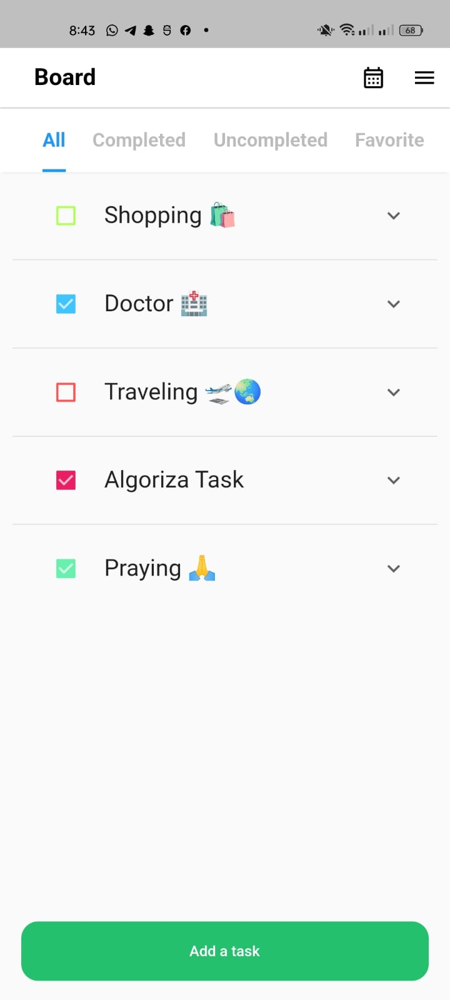
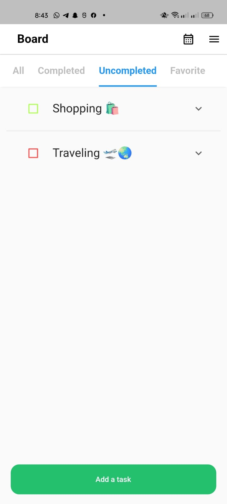
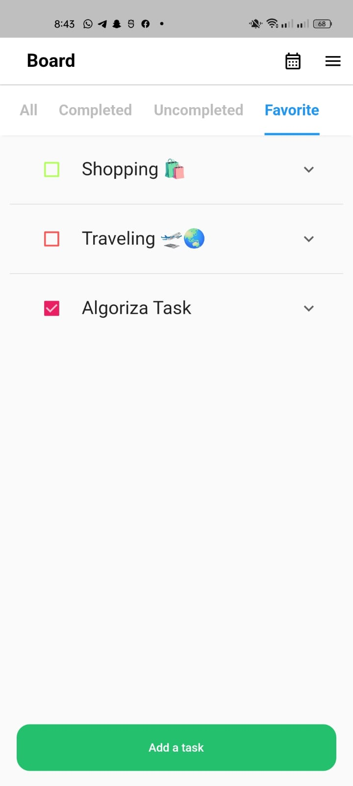
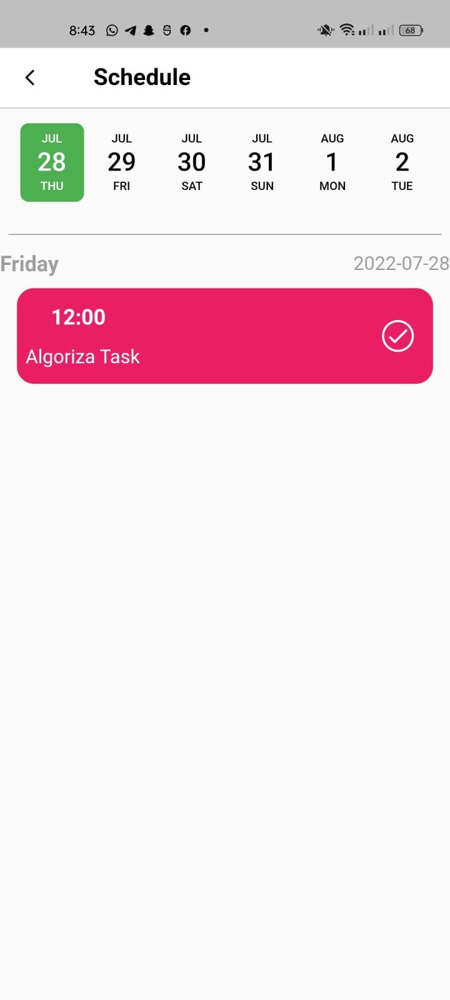
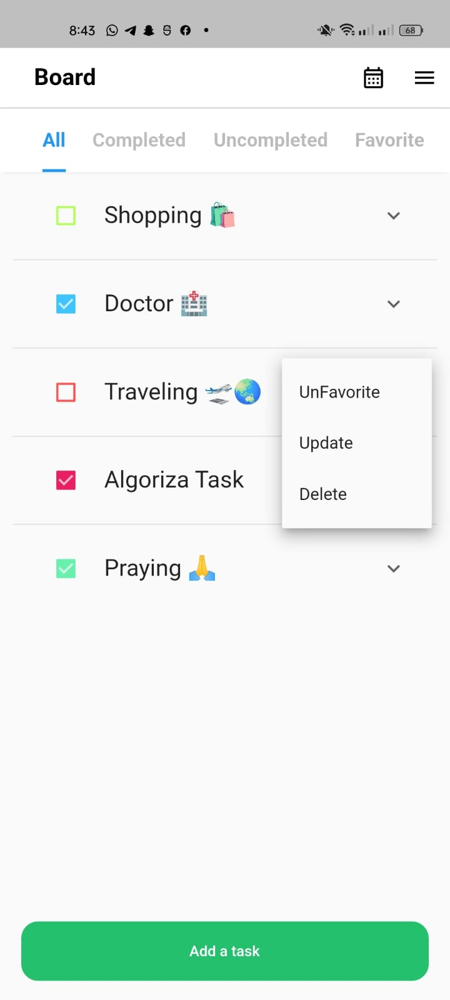
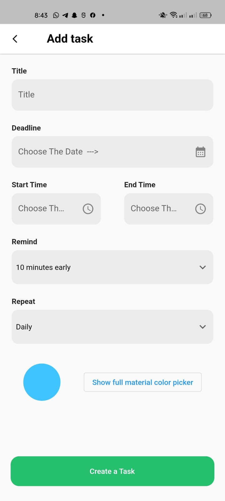
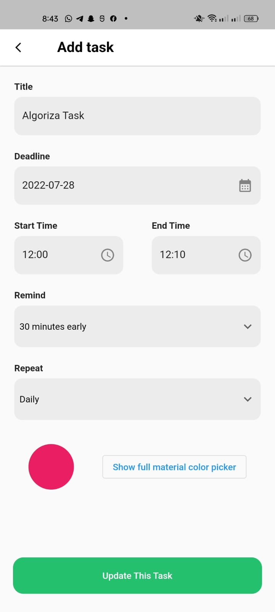

# todo_task

A new Flutter project.

## Getting Started

Video

All Tasks page

Completed Tasks page

UnCompleted Tasks page

Favorite Tasks page

Schedule Tasks page

Menu For More Option

Add Task page

Update Task page

